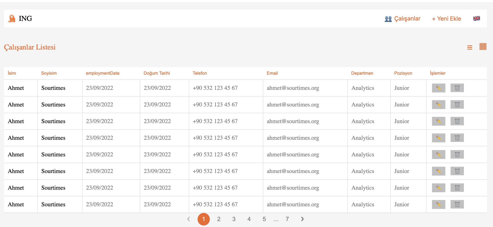

# ING HUB Employee Table application

to run the application
`npm run dev`

After running the application, please go to the below link in your browser
`http://localhost:3000`

to start the unit test
`npx karma start`

For creating docker images, the below command must be run in the root directory
`docker build -t ing-hub:latest . `

For running docker images with using nginx app server
`docker run -d  -p 8080:80 ing-hub:latest`

After that, please click the below link:
`http://localhost:8080`

